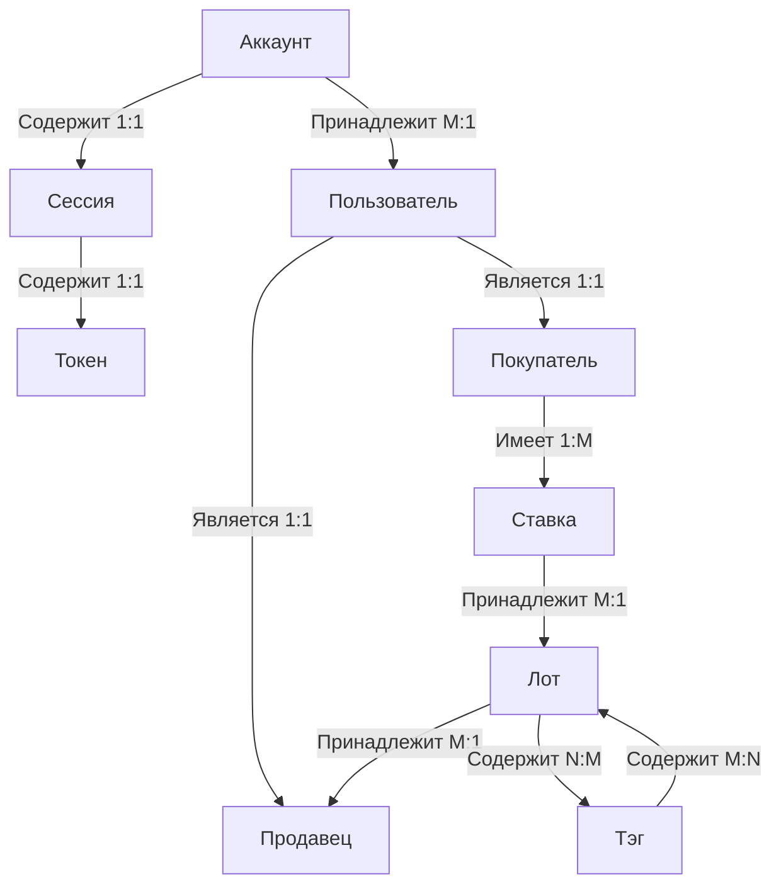

Модель связи между элементами представлена ниже:


Для описания полей и полной системы организации был применен язык моделирования баз данных `Prisma`. Все модели представлены ниже. 

> Ниже не подразумевается использование какой либо конкретной СУБД, все модели в целом применимы в документной, графовой или в реляционной базе. 

## Пользователь и система аутентификации

Модель пользователя имеет следующий вид:
```ts
model User {
    id            String    @id @default(uuid())
    name          String?
    email         String?   @unique
    emailVerified String
    imageUrl      String?
    accounts      Account[]
    sessions      Session[]
    vendor        Vendor?
    buyer         Buyer?
}
```

Сам факт того, что он является продавцом или покупателем отражен в связи с одним элементом соответствующих объектов `Vendor` и `Buyer`. Эта связь имеет тип 1:1. При этом у одного пользователя может быть несколько сессий и несколько аккаунтов.

Для входа в систему имеется токены типа OAuth и обычный токен для сессии. Так что таблицы сессии и аккаунта имеют вид:
```ts
model Session {
    id           String   @id @default(uuid())
    sessionToken String   @unique
    expires      DateTime
    user         User 
    userId       String
}
```

```ts
model Account {
    id                 String  @id @default(uuid())
    userId             String
    accType            String
    provider           String
    providerAccountId  String
    refresh_token      String?
    access_token       String?
    expires_at         Int?
    token_type         String?
    scope              String?
    id_token           String?
    session_state      String?
    oauth_token_secret String?
    oauth_token        String?
    user User 
}
```

## Модели покупателей и продавцов
Как было отмечено, пользователь ссылается на элемент множества покупателей и продавцов: 
```ts
model User{
    ...
    vendor        Vendor?
    buyer         Buyer?
}
```
Объект продавца имеет вид:
```ts
model Vendor {
    id     String @id @default(uuid())
    user   User
    userId String @unique
    lot    Lot[]
}
```
В ней есть указание на созданные лоты и на пользователя, которым данный продавец является. 

Модель покупателя имеет следующий вид, за исключением типа связи M:N с лотами через дополнительную модель (например промежуточная таблица) - `Bet` - ставка.

```ts
model Buyer {
    id     String @id @default(uuid())
    user   User   @relation(fields: [userId], references: [id])
    userId String @unique
    bet    Bet[]
}
```

Ставка хранит информацию и связывает лот с пользователем:
```ts
model Bet {
    id        String   @id @default(uuid())
    createdAt DateTime @default(now())
    updatedAt DateTime @updatedAt
    Buyer     Buyer
    Lot       Lot 
    price     Float
    current   Boolean  @default(true)
    canceled  Boolean  @default(false)
    buyerId   String
    lotId     String
}
```

## Лот и теги
Модель лота:
```ts
model Lot {
    id           String   @unique @default(uuid())
    description  String
    bet          Bet[]
    tags         Tag[]
    createdAt    DateTime @default(now())
    updatedAt    DateTime @updatedAt
    endDate      DateTime
    closed       Boolean  @default(false)
    minPrice     Float
    currentPrice Float
    vendor       Vendor   
    vendorId     String
}

```
У него есть ссылка на ставки, информация о том, закрыт ли он и связь с одним продавцом. Так же поддерживается связь M:N с таблицей тегов: 
```ts

model Tag {
    id   String @unique @default(uuid())
    lots Lot[]
    name String
}
```